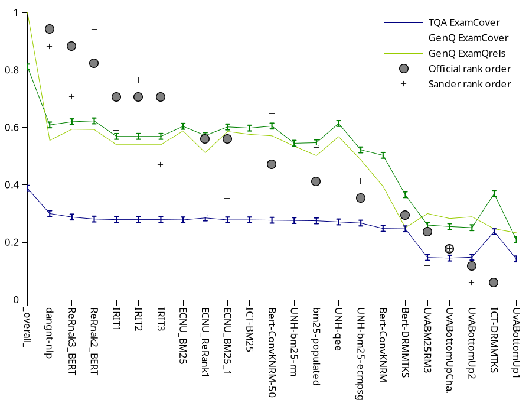

# Appendix for: Pencils Down! Evaluating Information Content with FLAN-T5-EXAM


## Errata

In Figure 2, due to a drag-and-drop error the methods "UvABottomUpCha." and "UvABM25RM3" were flipped. The data was correctly presented, just the sort order was incorrect. Updated figure below.



## Test Collections

In the experimental evaluation, we are using the following test collections:

* TREC CAR Y3:   <http://trec-car.cs.unh.edu/datareleases/>
  *  qrels and runs: [trec-car-runs-and-eva.tar.gz](http://trec-car.cs.unh.edu/results-Y3/trec-car-y3-runs-and-eval.tar.gz)

* TREC DL 19:   <https://trec.nist.gov/data/deep2019.html>
   * qrels [NIST judgments for the Passage Ranking task](https://trec.nist.gov/data/deep/2019qrels-pass.txt)
   * Runs  (l/p  via TREC organizers) [Deep Learning Track Passage Ranking Task Submission Files](https://trec.nist.gov/results/trec28/deep.passages.input.html)

* TREC DL 20:   <https://trec.nist.gov/data/deep2020.html> 
   * Qrels: [NIST judgments for the Passage Ranking task](https://trec.nist.gov/data/deep/2020qrels-pass.txt)
   * Runs  (l/p  via TREC organizers) [Deep Learning Track Passage Ranking Task Submission Files](https://trec.nist.gov/results/trec29/deep.passages.input.html)


## Prompts

### EXAM Question Generation Promps

The question generation prompts should reflect the goals of the IR tasks, and hence are data set specific.

* EXAM Question Generation for TREC CAR Y3:   [exam-qgen-CAR](prompts/exam-qgen-CAR)
* EXAM QuestionGeneration for TREC DL 2019 and 2020:   [exam-qgen-DL](prompts/exam-qgen-DL)


### EXAM Grading Prompts


* EXAM Grading prompt for question answering (for answer verification below)):     [exam-grading-qa](prompts/exam-grading-qa)
* EXAM Grading for Self-Rating of answerability     [exam-grading-self-rating](prompts/exam-grading-self-rating)


### Baselines: Relevance Judgment Prompts
As baselines we include prompts that directly ask to grade the relevance of a passage for a given query. We use the following prompts cited in literature:

* Faggioli et al: [Fag](prompts/Fag)   [Fag-few](prompts/Fag-few)
* Sun et al: [Sun](prompts/Sun)   [Sun-few](prompts/Sun-few)
* Thomas et al: [Thom](prompts/Thom) 


## EXAM Grading with FLAN-T5

For grading, we use the FLAN-T5-large model with the `text2text-generation` pipeline from Hugging Face.

Details are provided on [flan-t5-pipeline.md](flan-t5-pipeline.md)

## Answer Verification for Q/A

Details are provided at [answer-verification.md](answer-verification.md)


# Experimental Data


## Evaluation Measures

More details provided on [evaluation-measures.md](evaluation-measures.md)

### Leaderboard Rank Correlation

Using the official leaderboard as  reference, we use  Spearman's rank correlation coefficient ( `spearmanr`)  and and Kendall's Tau rank coorrelation ( `kendalltau`) from the   `scipy.stats` package.

We manually transcribed the official leaderboards from the respective TREC Overview notebooks.


### Inter-annotator Agreement
Cohen's kappa inter-annotator agreement: per-passage, do the relevance labels predicted with our methods agree with relevance judgments according to the official TREC assessors?

We use binary agreements based on a confusion matrix. For graded relevance, we either use an exact match with the grade, or we merge different grades. As an example, Figure 5, bottom merges predicted relevance grades 4+5 into the relevant class, to be compared to judgment grades 1+2+3. 

We implement Cohen's kappa as follows.

```python
        pe = (pyes * pyes_rated) + (pno * pno_rated)
        kappa = (po - pe) / (1 - pe)
```


## Raw EXAM graded data

 CAR Y3:  [CAR-graded-t5-rating-genq-tqa-rating-cc-exam-qrel-runs-result.jsonl.xz](EXAM-graded-data/CAR-graded-t5-rating-genq-tqa-rating-cc-exam-qrel-runs-result.jsonl.xz) 
 
 This file contains  Passages from official qrels files and the top 20 (per section-level query) of all participant submitted run files


 EXAM grades for 
 
 *  TQA Exam Cover ( TQA questions, verification with QA and Answer Verification): 
   * `"llm": "google/flan-t5-large"`
   * `"prompt_info.prompt_class": "QuestionCompleteConcisePromptWithAnswerKey2",`
   * TQA question IDs,  format `NDQ_{number}` 


 *  GenQ Exam Cover and GenQ Exam Qrels  ( Generated questions, Self-rated): 
   * `"llm": "google/flan-t5-large"`
   * `"prompt_info.prompt_class": "QuestionSelfRatedUnanswerablePromptWithChoices",`
   * question ID format `tqa2:{query_id}/{query_subtopic_id)/{md5_hash_of_question_text)`


 *  not included ( TQA questions, Self-rated): 
   * `"llm": "google/flan-t5-large"`
   * `"prompt_info.prompt_class": "QuestionSelfRatedUnanswerablePromptWithChoices",`
   * TQA question IDs,  format `NDQ_{number}` 


EXAM grades for additional (omitted) question-answering  experiments for CAR Y3: [CAR-graded-squad2-t5-qa-tqa-exam--benchmarkY3test-exam-qrels-runs-with-text.jsonl.xz](EXAM-graded-data/CAR-graded-squad2-t5-qa-tqa-exam--benchmarkY3test-exam-qrels-runs-with-text.jsonl.xz) 
 
 This file contains  Passages from official qrels files and the top 20 (per section-level query) of all participant submitted run files


 * not included (TQA questions, squad2-finetuned model of FLAN-T5-large, verification with QA and Answer Verification)
   * `"llm": "sjrhuschlee/flan-t5-large-squad2"`
   * `"prompt_info.prompt_class": "QuestionCompleteConcisePromptWithAnswerKey2",`
   * TQA question IDs,  format `NDQ_{number}` 
   
   
 * not included (TQA questions, untuned model, prompt without instructions, verification with QA and Answer Verification)
   * `"llm": "google/flan-t5-large"`
   * `"prompt_info.prompt_class": "QuestionCompleteConcisePromptWithAnswerKey2",`
   * TQA question IDs,  format `NDQ_{number}` 
   
   


# Additional Results

* Results on CAR Y3 [car-results/](car-results/)   
  *  \*tsv are provide EXAM, n-EXAM and standard errors for each column in Table 3) 
  * \*gnumeric provide the collated results for EXAM including the plot for Figure 2 (tab: "pretty").

* Results from relevance-grading baslines (Sun, Fag, Thom):  [results-relevance-grading.md](results-relevance-grading.md)


